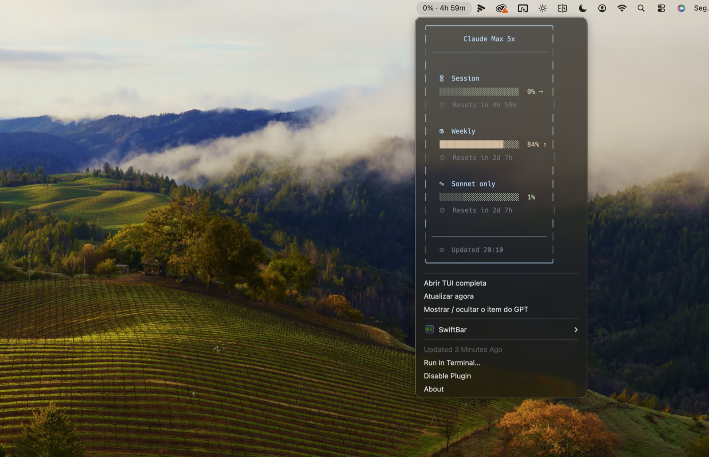

# ai-usagemonitor

> **ai-usagemonitor** is a macOS-focused redistribution of **[akitaonrails/ai-usagebar](https://github.com/akitaonrails/ai-usagebar)** (MIT License — © 2026 AkitaOnRails). The original Rust source and the [`LICENSE`](LICENSE) are kept unchanged; all upstream credit belongs to AkitaOnRails. The macOS menu-bar integration is © 2026 Davi Ribeiro, also under MIT.

A **macOS menu bar** app that shows your AI plan usage — session, weekly and per-model limits — for **Anthropic Claude**, **OpenAI / Codex**, **Z.AI (GLM)**, and **OpenRouter**. It also ships an interactive terminal UI (`ai-usagebar-tui`).



---

## Install (macOS)

You need [Homebrew](https://brew.sh). Then run the steps below.

### 1. Prerequisites

```bash
brew install rust                              # to build the tool
brew install --cask swiftbar font-hack-nerd-font   # menu-bar host + icons
```

> `jq` is used by the menu-bar plugins and ships with modern macOS at `/usr/bin/jq`. If it's missing, run `brew install jq`.

### 2. Build and install the binaries

```bash
git clone https://github.com/odaviribeiro1/ai-usagemonitor.git
cd ai-usagemonitor
cargo install --path .     # installs ai-usagebar and ai-usagebar-tui to ~/.cargo/bin
```

Make sure `~/.cargo/bin` is on your `PATH` (Homebrew's Rust adds it for new shells; otherwise add it to your `~/.zshrc`).

### 3. Add the menu-bar items

```bash
mkdir -p "$HOME/Library/Application Support/SwiftBar/Plugins"
cp macos/swiftbar/*.sh "$HOME/Library/Application Support/SwiftBar/Plugins/"
chmod +x "$HOME/Library/Application Support/SwiftBar/Plugins/"*.sh
open -a SwiftBar
```

On first launch SwiftBar asks for a plugins folder — pick the one above. You'll get one menu-bar item per vendor (Claude and OpenAI by default).

### 4. Connect your accounts

| Vendor | What to do |
|---|---|
| **Claude** | Export the token the Claude app stored in the macOS Keychain (one time): see below. |
| **OpenAI / Codex** | Just run `codex login` once — `ai-usagemonitor` reads `~/.codex/auth.json` automatically. |
| **Z.AI** | `export ZAI_API_KEY=...` (in the plugin script, since the menu bar runs with a minimal environment). |
| **OpenRouter** | `export OPENROUTER_API_KEY=...` (same as above). |

**Claude on macOS** keeps its OAuth token in the **Keychain**, not in a file, so export it once:

```bash
security find-generic-password -s "Claude Code-credentials" -w > ~/.claude/.credentials.json
chmod 600 ~/.claude/.credentials.json
```

That's it — your usage shows up in the menu bar and refreshes every 5 minutes.

---

## Using it

- **Click a menu-bar item** to see the full breakdown (Session / Weekly / Credits), open the TUI, or refresh.
- **Show / hide the OpenAI item:** the Claude item's dropdown has *"Mostrar / ocultar o item do GPT"*; the OpenAI item has *"Ocultar este item (GPT)"*.
- **Terminal UI:** run `ai-usagebar-tui` for an interactive, tabbed view of all vendors.
- **Quick check from the shell:**
  ```bash
  ai-usagebar --vendor anthropic     # pretty terminal output
  ai-usagebar --vendor openai --watch 5   # live, refreshes every 5s
  ```

See [`macos/swiftbar/README.md`](macos/swiftbar/README.md) to change the refresh interval, add more vendors, or tweak the labels.

---

## Configuration (optional)

Everything works with defaults. To customize, create `~/.config/ai-usagebar/config.toml`:

```toml
[ui]
# primary = "anthropic"    # anthropic | openai | zai | openrouter

[anthropic]
enabled = true

[openai]
enabled = true

[zai]
enabled = true
api_key_env = "ZAI_API_KEY"
# api_key = "..."          # alternative to the env var; chmod 600 this file if used

[openrouter]
enabled = true
api_key_env = "OPENROUTER_API_KEY"
# api_key = "sk-or-v1-..."
```

If you put inline `api_key` values in the config, run `chmod 600 ~/.config/ai-usagebar/config.toml`.

---

## Credits & license

This project redistributes **[akitaonrails/ai-usagebar](https://github.com/akitaonrails/ai-usagebar)** under the **MIT License** (© 2026 AkitaOnRails). See [`LICENSE`](LICENSE). macOS packaging and the SwiftBar plugins © 2026 Davi Ribeiro, MIT.
